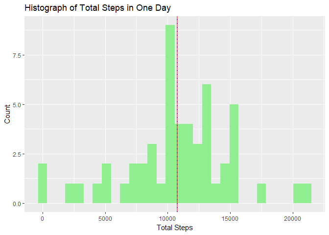
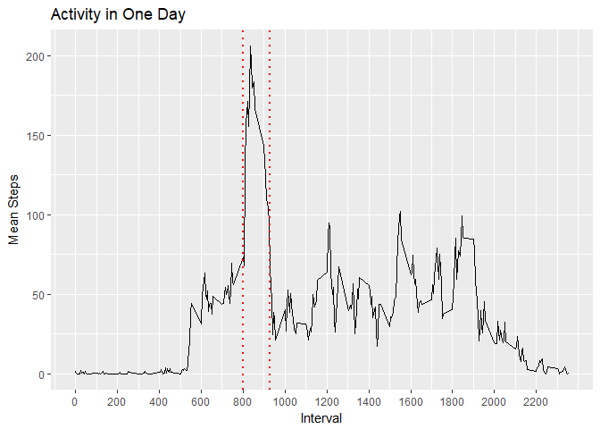
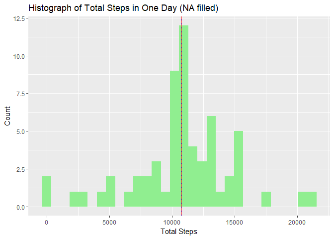
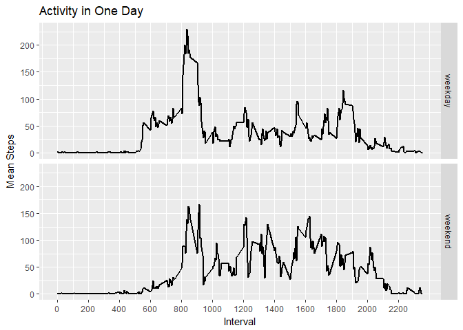
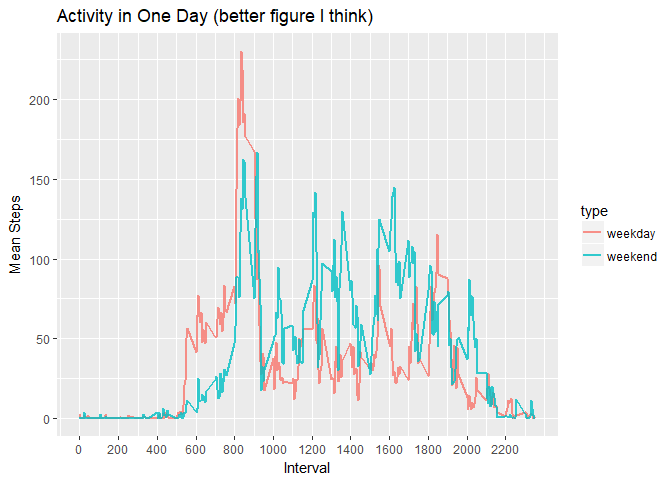

## Loading and preprocessing the data
first use unzip("activity.zip") to get the "activity.csv"   
then use read.csv() read it into a data.frame I named "a"  
and some necessay transformation of this data.frame  

```r
unzip("activity.zip")
a <- read.csv("activity.csv")
str(a)
```

```
'data.frame':	17568 obs. of  3 variables:
 $ steps   : int  NA NA NA NA NA NA NA NA NA NA ...
 $ date    : Factor w/ 61 levels "2012-10-01","2012-10-02",..: 1 1 1 1 1 1 1 1 1 1 ...
 $ interval: int  0 5 10 15 20 25 30 35 40 45 ...
```

```r
a$steps <- as.numeric(a$steps)
a$date <- as.Date(a$date,"%Y-%m-%d")
a$interval <- as.factor(as.character(a$interval))
str(a)
```

```
'data.frame':	17568 obs. of  3 variables:
 $ steps   : num  NA NA NA NA NA NA NA NA NA NA ...
 $ date    : Date, format: "2012-10-01" "2012-10-01" ...
 $ interval: Factor w/ 288 levels "0","10","100",..: 1 226 2 73 136 195 198 209 212 223 ...
```

## What is mean total number of steps taken per day?
the sum of steps in a day can be calculated using tapply  
store this result in a data.frame named "daySum",and the mean and median steps per day into "day_mean_steps" and "day_median_steps" respectively

```r
daySum <- tapply(a$steps,a$date,sum)
daySum <- cbind(daySum,names(daySum))
colnames(daySum) <- c("Total_Step","Date")
daySum <- as.data.frame(daySum)
daySum$Date <- as.Date(daySum$Date,"%Y-%m-%d")
daySum$Total_Step <- as.numeric(as.character(daySum$Total_Step))
day_mean_steps <- mean(daySum$Total_Step, na.rm=T)
day_median_steps <- median(daySum$Total_Step, na.rm=T)
sprintf("The mean of steps taken in one day is %f",day_mean_steps)
```

```
[1] "The mean of steps taken in one day is 10766.188679"
```

```r
sprintf("The median of steps taken in one day is %g",day_median_steps)
```

```
[1] "The median of steps taken in one day is 10765"
```
then, let's see the histoprah of mean daily steps  
use ggplot2, the the mean and median steps are showed as red solid line and blue dotted line, becasue the mean and median are very close so the two lines overlapped

```r
library(ggplot2)
g <- ggplot(daySum,aes(Total_Step))
g <- g + geom_histogram(bins = 30,fill='lightgreen')
g <- g + geom_vline(xintercept=c(day_mean_steps,day_median_steps),color=c("red","blue"),linetype=c(1,3),size=1,alpha=0.5)
g <- g + labs(x="Total Steps",y="Count",title="Histograph of Total Steps in One Day")
print(g)
```

```
Warning: Removed 8 rows containing non-finite values (stat_bin).
```

<!-- -->

## What is the average daily activity pattern?
first, find the mean steps of every intervals through all days  
this can be down by combining split and sapply, the split function take a factor argument so I transformed a$interval at the beginning, "na.rm=T" should pass to mean function or only get 288 NAs  
store this as a data.frame named "itvMean"

```r
interval_mean_steps <- sapply(split(a$steps,a$interval),mean,na.rm=T)
itvMean <- cbind(names(interval_mean_steps),interval_mean_steps)
colnames(itvMean) <- c("Interval","Mean_Step")
itvMean <- as.data.frame(itvMean)
itvMean$Interval <- as.numeric(as.character(itvMean$Interval))
itvMean$Mean_Step <- as.numeric(as.character(itvMean$Mean_Step))
itvMean <- itvMean[order(itvMean$Interval),]
x = which.max(itvMean$Mean_Step)
sprintf("The most of steps in one interval is about %g",itvMean[x,2])
```

```
[1] "The most of steps in one interval is about 206.17"
```

```r
sprintf("It happens at interval %g", itvMean[x,1])
```

```
[1] "It happens at interval 835"
```
the daily activity is shown below as a line plot, and the most active time in one day is around 8:00 - 9:30

```r
library(ggplot2)
g <- ggplot(itvMean,aes(Interval,Mean_Step))
g <- g + geom_line()
g <- g + scale_x_continuous(breaks=seq(0, 2355, 200))
g <- g + geom_vline(xintercept=c(800,930),color="red",linetype=3,size=1)
g <- g + labs(x="Interval",y="Mean Steps",title="Activity in One Day")
print(g)
```

<!-- -->

## Imputing missing values
data.frame daySum tell us there are 8 days that no activites recorded at all, they are listed below 

```r
daySum[which(is.na(daySum$Total_Step)),2]
```

```
[1] "2012-10-01" "2012-10-08" "2012-11-01" "2012-11-04" "2012-11-09"
[6] "2012-11-10" "2012-11-14" "2012-11-30"
```

```r
naDate <- daySum[which(is.na(daySum$Total_Step)),2]
```
I hnow the records per day is 288 (nrow(itvMean)), so we just check whether days without records mutily by 288 equals to the total missing records  
and it's true  
so the missing records are all in the 8 days

```r
totalna <- sum(is.na(a$steps))
n_interval_per_day <- nrow(itvMean)
totalna == n_interval_per_day * length(naDate)
```

```
[1] TRUE
```
filling with mean steps of interval may be better because the total steps per day has larger SD means the variation of total steps per day is bigger than steps of interval

```r
interval_sd <- sapply(split(a$steps,a$interval),sd,na.rm=T)
day_sd <- tapply(a$steps,a$date,sd)
summary(interval_sd)
```

```
   Min. 1st Qu.  Median    Mean 3rd Qu.    Max. 
   0.00   10.36   90.76   82.98  126.35  293.00 
```

```r
summary(day_sd)
```

```
   Min. 1st Qu.  Median    Mean 3rd Qu.    Max.    NA's 
  1.999  81.791 113.627 105.122 130.017 175.275       8 
```
the new data.frame filled with mean steps of interval is "a_new"  
then run simmilar code like before, the mean is the same as before, but the median is changed a little

```r
a_new <- a
for (i in unique(a_new$interval)) {
    a_new[which(is.na(a_new)&a_new$interval==i),1] <- itvMean[which(itvMean$Interval==i),2]
}
daySum_new <- tapply(a_new$steps,a_new$date,sum)
daySum_new <- cbind(daySum_new,names(daySum_new))
colnames(daySum_new) <- c("Total_Step","Date")
daySum_new <- as.data.frame(daySum_new)
daySum_new$Date <- as.Date(daySum_new$Date,"%Y-%m-%d")
daySum_new$Total_Step <- as.numeric(as.character(daySum_new$Total_Step))
day_mean_steps_new <- mean(daySum_new$Total_Step)
day_median_steps_new <- median(daySum_new$Total_Step)
sprintf("The new mean of steps taken in one day is %f, old value is %f",day_mean_steps_new,day_mean_steps)
```

```
[1] "The new mean of steps taken in one day is 10766.188679, old value is 10766.188679"
```

```r
sprintf("The new median of steps taken in one day is %f, old value is %f",day_median_steps_new,day_median_steps)
```

```
[1] "The new median of steps taken in one day is 10766.188679, old value is 10765.000000"
```
polt a histogram using gglot2 with identical argument, the shape of the figure almost the same as before, just the peak counts shift a little  
it seems that using mean value fill NA is a good idea, it won't change the distribution very much

```r
library(ggplot2)
g <- ggplot(daySum_new,aes(Total_Step))
g <- g + geom_histogram(bins = 30,fill='lightgreen')
g <- g + geom_vline(xintercept=c(day_mean_steps,day_median_steps),color=c("red","blue"),linetype=c(1,3),size=1,alpha=0.5)
g <- g + labs(x="Total Steps",y="Count",title="Histograph of Total Steps in One Day (NA filled)")
print(g)
```

<!-- -->

## Are there differences in activity patterns between weekdays and weekends?
first, set location to some English aera, or the weekdays function may return in different language other than English (for us non-native English learner),and may cause problems 

```r
Sys.setlocale("LC_TIME", "us")
```

```
[1] "English_United States.1252"
```

```r
weekend = which((weekdays(a_new$date)=="Sunday")|(weekdays(a_new$date)=="Saturday"))
a_new_weekend <- a_new[weekend,]
a_new_weekday <- a_new[-weekend,]
interval_weekend <- sapply(split(a_new_weekend$steps,a_new_weekend$interval),mean)
interval_weekday <- sapply(split(a_new_weekday$steps,a_new_weekday$interval),mean)
x <- cbind(names(interval_weekday),interval_weekday)
x <- as.data.frame(x)
x$type <- "weekday"
colnames(x) <- c("Interval","Steps","type")
y <- cbind(names(interval_weekend),interval_weekend)
y <- as.data.frame(y)
y$type <- "weekend"
colnames(y) <- c("Interval","Steps","type")
itvNew <- rbind(x,y)
itvNew$Interval <- as.numeric(as.character(itvNew$Interval))
itvNew$Steps <- as.numeric(as.character(itvNew$Steps))
itvNew$type <- as.factor(itvNew$type)
itvNew <- itvNew[order(itvNew$Interval),]
```
panel plot as the assignment, but I don't like it

```r
library(ggplot2)
g <- ggplot(itvNew,aes(Interval,Steps))
g <- g + geom_line(size=1) + facet_grid(type~.)
g <- g + scale_x_continuous(breaks=seq(0, 2355, 200))
g <- g + labs(x="Interval",y="Mean Steps",title="Activity in One Day")
print(g)
```

<!-- -->
    
I think plot the two lines in one panel will be more intuitive  
1. in weekdays the activites start earlier than weekends, may be the user has to get up and go to work  
2. in weekdays during 10:00 to 18:00, the user has less activity than weekends, indicate the user's job doesn't requre much movement  

```r
library(ggplot2)
g <- ggplot(itvNew,aes(Interval,Steps,color=type)) + geom_line(size=1,alpha=0.8)
g <- g + scale_x_continuous(breaks=seq(0, 2355, 200))
g <- g + labs(x="Interval",y="Mean Steps",title="Activity in One Day (better figure I think)")
print(g)
```

<!-- -->
